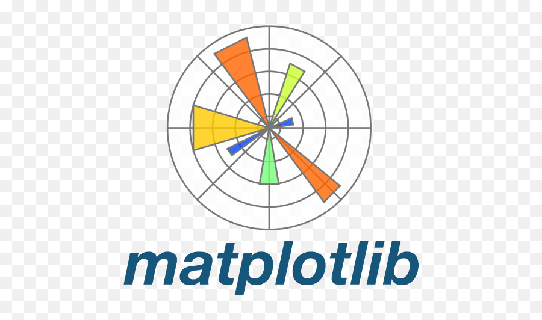

MY PORTFOLIO
<h1 align="center">Hi 👋, I am Sandhya</h1>

 

- 🌱 I’m currently learning *Data Analytics*

- 👨‍💻 Watch my LinkedIn profile:  [https://www.linkedin.com/in/hello-sandhya-verma/](https://www.linkedin.com/in/hello-sandhya-verma/)

- 📫 How to reach me: *sandhya.verma.aiml@gmail.com*

  

 
<h3 align="left"> 🧑‍💻 TECH STACK:</h3>

  
  
  
   
  
  
  
  
  
   
   
   
  

<h3 align="center">📈 Aspiring Data Analyst | 🐍 Python | 📊 Power BI | 🔍 SQL | 🧠 Machine Learning </h3>
 

## 🚀 About Me  

- 👋 Aspiring **Data Analyst** with hands-on skills in **Python**, **SQL**, **Power BI**, and **Machine Learning**.  
- ✅ Recently completed **Python for Data Analytics** & **Statistics** modules.  
- 🤖 Currently exploring **Machine Learning** (Supervised & Unsupervised).  
- 🛠️ Tools I use: **Jupyter Notebook**, **GitHub**, **MySQL**, **Power BI**.  
- 📂 Building hands-on projects and sharing everything on GitHub.  
- 💬 Passionate about simplifying complex ideas and data storytelling.  

## 🧑‍💻 Skills and Technologies  

### **Languages, Libraries & Frameworks** 📚  
            

### **Databases, Tools & Software** 🛠️  
      

## 📊 GitHub Analytics  

  
  

  

## 🔥 GitHub Streak  

  

## 📌 Featured Projects  

- 📂 [Python Assignments](https://github.com/CoderSugata/PythonAssignments)  
- 📂 [Statistics Assignments](https://github.com/CoderSugata/StatisticsAssignments)  
- 📂 [Machine Learning Assignments](https://github.com/CoderSugata/MachineLearningAssignments)  
- 📂 [DSA With Java](https://github.com/CoderSugata/DSAwithJava) (_Personal repo_ 😁)  

> _"I like to help people, but I'm not a people-pleaser."_ – **S.M** 🧿  
